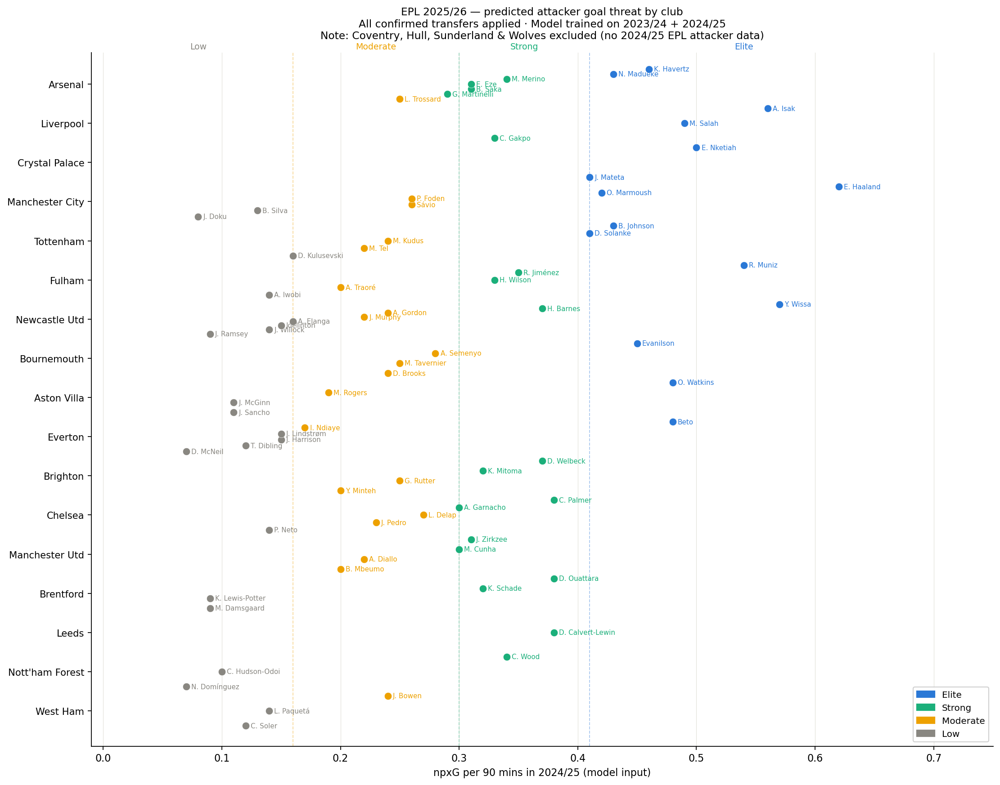

# EPL 2025/26 Attacker Goal Threat Predictor

Predicting EPL attacker goal threat tiers for the 2025/26 season using ordered logistic regression, trained on two seasons of FBref player data with all confirmed summer 2025 transfers applied.

---

## What this predicts

For every attacker (FW position, 900+ minutes) who played in the EPL in 2024/25, the model predicts which **goal threat tier** they are likely to fall into in 2025/26:

| Tier | Definition | npxG/90 threshold |
|---|---|---|
| **Elite** | Top 20% of EPL attackers by npxG/90 | ≥ 0.41 |
| **Strong** | 55th–80th percentile | 0.30–0.41 |
| **Moderate** | 25th–55th percentile | 0.16–0.30 |
| **Low** | Bottom 25% | < 0.16 |

---

## Why ordered logit?

The target has a natural order — Elite is strictly better than Strong, which is strictly better than Moderate. Ordered logistic regression (proportional odds model) captures this by modelling a single latent "goal threat" axis with three cut-points, rather than treating the four tiers as unrelated categories. This is more appropriate than multinomial logistic regression for this problem.

---

## Methodology

### Target variable
npxG per 90 (non-penalty expected goals) is used as the anchor metric. Tiers are assigned by **percentile rank within each season** — the top 20% of attackers in a given season are Elite, regardless of what the absolute npxG values are. This avoids cross-season drift in scoring levels.

Using npxG as the target rather than the composite score as a feature keeps the target cleanly independent of the model features, avoiding the circular dependency that caused perfect separation in earlier iterations.

### Features (all from the previous season — no leakage)
- `Gls.1` — actual goals per 90 (independent signal from npxG)
- `Ast.1` — actual assists per 90
- `xAG.1` — expected assisted goals per 90 (chance creation)
- `PrgC_90` — progressive carries per 90
- `PrgR_90` — progressive receptions per 90 (movement into dangerous areas)
- `goal_diff` — actual goals minus npxG (finishing quality signal)
- `Age` — age
- `age_sq` — age squared (nonlinear career curve)
- `min_per_game` — minutes per appearance (manager trust / fitness)

### Why these features?
The model answers: *given what we know about a forward's output and profile in season X, can we predict their goal threat tier in season X+1?* Features are chosen to be genuinely independent of the npxG target — actual goals, assists, progressive actions, and age all carry real predictive signal without simply replicating the target.

### Train/test split
- **Validation test**: train on 2023/24 only (109 attacker-seasons), test on 2024/25 (103 attacker-seasons) — strictly temporal, no look-ahead
- **Final model for predictions**: retrained on both 2023/24 + 2024/25 combined (212 rows), then applied to 2024/25 stats to predict 2025/26

### Transfer logic
Transfers are applied **before** any squad-based filtering — this is critical for players like Matheus Cunha (Wolves → Man Utd) and Liam Delap (Ipswich → Chelsea), whose old clubs are excluded from the dataset but who are correctly included under their new clubs.

---

## Results

### Cross-season validation (train 2023/24 → test 2024/25)

| | Score |
|---|---|
| Test accuracy | **88.3%** |
| Naive baseline (always "Moderate") | 30.1% |

Confusion matrix:

|  | Pred Low | Pred Moderate | Pred Strong | Pred Elite |
|---|---|---|---|---|
| **Actual Low** | 26 | 0 | 0 | 0 |
| **Actual Moderate** | 8 | 23 | 0 | 0 |
| **Actual Strong** | 0 | 4 | 22 | 0 |
| **Actual Elite** | 0 | 0 | 0 | 20 |

Elite and Strong are predicted with 100% precision. Most misclassifications are at the Moderate/Low boundary — the hardest class to distinguish.

### 2025/26 predictions



---

## Transfers applied

**Left EPL entirely:** Diogo Jota (deceased), Luis Díaz (Bayern Munich), Darwin Núñez (Al-Hilal), Nicolas Jackson (Bayern loan), Christopher Nkunku (AC Milan), Marcus Rashford (Barcelona loan), Rasmus Højlund (Napoli loan), Son Heung-min (LAFC), Kevin De Bruyne (Napoli), Leon Bailey (Roma loan), Gonçalo Guedes (Real Sociedad)

**Internal EPL moves applied:**
- Bryan Mbeumo, Matheus Cunha → Manchester Utd
- Alejandro Garnacho → Chelsea
- Noni Madueke, Eberechi Eze → Arsenal
- Alexander Isak → Liverpool
- Yoane Wissa, Anthony Elanga, Jacob Ramsey → Newcastle Utd
- Mohammed Kudus → Tottenham
- Dango Ouattara → Brentford
- Dominic Calvert-Lewin → Leeds
- João Pedro, Liam Delap → Chelsea
- Tyler Dibling → Everton
- Jadon Sancho → Aston Villa (loan)

**2024/25 relegated clubs excluded:** Southampton, Leicester City, Ipswich Town

---

## Known limitations

**npxG is a goal threat metric, not a general attacker quality metric.** The target measures shot quality and volume — it is well-suited to pure strikers but systematically underrates wide forwards and creative players. Jadon Sancho, Jeremy Doku, and Kevin De Bruyne rank Low/Moderate not because they are poor attackers but because npxG does not capture chance creation, progressive carrying, or pressing. A more complete version would run separate models by position sub-type — npxG for strikers, xAG + PrgC for wide attackers — matching how FBref and StatsBomb handle positional differences in their own rating systems.

**New signings from outside EPL are invisible.** Players like Viktor Gyokeres (Arsenal), Florian Wirtz (Liverpool), Benjamin Sesko (Man Utd), Hugo Ekitike (Liverpool), and Nick Woltemade (Newcastle) have no 2024/25 EPL data and do not appear. The model systematically underestimates clubs that rebuilt heavily with external signings. This is the most significant limitation for real-world use.

**Promoted clubs and Wolves excluded.** Coventry City, Hull City, Sunderland, and Wolves have no representative 2024/25 EPL attacker data. Noted in the chart subtitle.

**Perfect separation in coefficients.** With 212 training rows the model achieves near-perfect fit on the training data, causing unstable coefficient estimates and unreliable p-values. The cross-season accuracy (88.3%) is a genuine out-of-sample result but the coefficient magnitudes should not be over-interpreted. Extending to additional seasons of training data is the natural next step.

**Ordinal proportional odds assumption untested.** A Brant test would verify whether the effect of each feature is consistent across all three tier boundaries — left for a future iteration.

---

## Repo structure

```
├── part1_load_and_features.py     load FBref data, filter, engineer features
├── part2_train_model.py           cross-season validation (23/24 → 24/25)
├── part3_retrain_and_predict.py   retrain on both seasons, apply transfers, predict
├── part4_visualise.py             dot plot by club with player labels
├── attacker_goal_threat_2526.csv  full prediction output
├── attacker_goal_threat_2526.png  visualisation
└── README.md
```

**Run order:**
```
python3 part1_load_and_features.py
python3 part2_train_model.py
python3 part3_retrain_and_predict.py
python3 part4_visualise.py
```

---

## Data sources

Raw CSV files are not committed due to file size. Download from:

| File | Source |
|---|---|
| `premier-player-23-24.csv` | [Kaggle — EPL Player Stats 23/24](https://www.kaggle.com/datasets/orkunaktas/premier-league-all-players-stats-2324) |
| `fbref_PL_2024-25.csv` | [Kaggle — FBRef EPL 2024/25](https://www.kaggle.com/datasets/siddhrajthakor/fbref-premier-league-202425-player-stats-dataset) |

---

## Dependencies

```
pandas, numpy, statsmodels, scikit-learn, matplotlib
```

---

*Part of an ongoing self-directed sports analytics portfolio built alongside the University of Michigan Sports Performance Analytics Specialisation (Coursera).*
